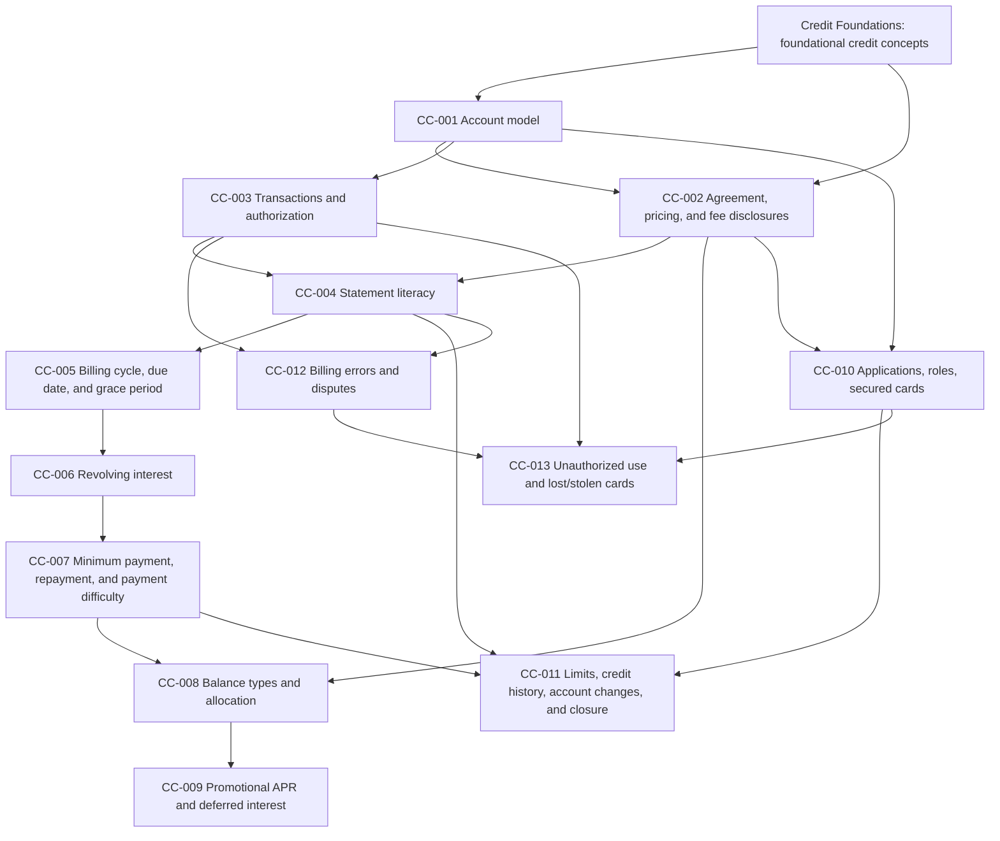

# Credit Cards World Blueprint

**Domain:** Credit  
**World:** Credit Cards  
**Document type:** Research-backed World Blueprint  
**Blueprint version:** 1.0-rc1  
**Status:** Approved revision candidate — accepted minor revisions incorporated; freeze pending Credit Foundations registry reconciliation and governance-owner verification  
**Research date:** 2026-07-19  
**Revision date:** 2026-07-19  
**Jurisdiction:** Approved — United States consumer credit cards; federal law is the instructional baseline, material state-law variation is acknowledged where appropriate, and no state-by-state legal instruction is included  
**Audience:** Approved — beginner consumers, inclusive of older teens and adults, using plain language with no assumption of prior card ownership or use  

## Document controls

This document is research and approved world-structure design only. It does not contain Educational Drafts, workbook prose, manifests, runtime specifications, or compiler changes. It does not alter the frozen governance architecture or approved workflow. It is informational education, not financial or legal advice.

The evidence labels mean:

- **FACT** — supported by authoritative sources or by the supplied approved project context.
- **HYPOTHESIS** — a proposed educational-design conclusion that requires review and approval.
- **UNKNOWN** — information not established by available authoritative materials or unavailable project records.

The current local repository does not contain the completed CRF-001 through CRF-015 Approved Educational Content or its generated concept registry. The supplied project context is therefore the authority for the stated Credit Foundations status, while exact concept IDs, canonical definitions, and workbook mappings remain unavailable for reconciliation.

## Executive recommendation

**APPROVED STRUCTURE:** Credit Cards is a 13-workbook world organized into five instructional stages:

1. Understand the account and its terms.
2. Follow transactions through a billing cycle and read the statement.
3. Understand payment choices, grace periods, interest, and multiple balance types.
4. Understand account access, applications, credit reporting, and product variations.
5. Recognize errors, unauthorized use, account changes, and problem escalation.

This sequence reuses Credit Foundations concepts including **Credit, Borrower, Creditor, Debt, Loan, Principal, Interest, Interest rate, APR, Repayment, Credit agreement, Revolving credit, Creditworthiness, Delinquency, and Default**. Exact canonical identifiers and approved wording remain provisional until registry reconciliation. The world introduces only the card-specific structures necessary to understand revolving credit, statements, costs, account roles, and consumer protections.

**FREEZE CONDITION:** Jurisdiction, audience, workbook count, sequence, and minor revisions are approved. Workbook development must not begin until the proposal has been checked against the authoritative Credit Foundations concept registry, clause-level governance compliance is confirmed, and this `1.0-rc1` candidate is formally frozen as version 1.0.

---

# Research findings ledger

## Core product mechanics

1. **FACT:** A credit card account is open-end credit: the borrower may make transactions up to an available limit, repay amounts, and reuse restored available credit subject to the agreement. The CFPB’s model contract materials distinguish the bill, billing period, purchase, balance transfer, cash advance, credit limit, and available credit as related but separate account concepts. [CFPB, Know Before You Owe: Credit Cards](https://www.consumerfinance.gov/data-research/credit-card-data/know-you-owe-credit-cards/) and [CFPB credit card contract definitions](https://www.consumerfinance.gov/data-research/credit-card-data/know-you-owe-credit-cards/credit-card-contract-definitions/)

2. **FACT:** A merchant normally requests authorization from the issuer. Authorization indicates that the account is valid and sufficient credit is available; it is not the same as final posting, correctness, legality, or acceptance of a billing charge. [CFPB, card authorization](https://www.consumerfinance.gov/ask-cfpb/when-i-went-to-use-my-credit-card-the-store-told-me-the-charge-was-not-authorized-what-does-that-mean-what-can-i-do-en-32/)

3. **HYPOTHESIS:** Learners should understand the account, issuer/cardholder roles, credit limit, available credit, authorization, and transaction posting before studying statements or interest. Otherwise, later concepts lack a coherent account model.

## Disclosures, statements, and payment information

4. **FACT:** Account-opening disclosures and periodic statements communicate material rates, fees, balance, payment, transaction, and interest information. Regulation Z requires the due date and related payment warnings to be displayed prominently on periodic statements. [CFPB Regulation Z §1026.6](https://www.consumerfinance.gov/rules-policy/regulations/1026/6/), [CFPB Regulation Z §1026.7](https://www.consumerfinance.gov/rules-policy/regulations/1026/7/), and [CFPB statement analysis guide](https://files.consumerfinance.gov/f/documents/cfpb_building_block_activities_analyzing-credit-card-statements_guide.pdf)

5. **FACT:** A billing period is the fixed period covered by the bill. A statement balance is tied to a cycle closing date, while later activity can change the current account balance. [CFPB credit card contract definitions](https://www.consumerfinance.gov/data-research/credit-card-data/know-you-owe-credit-cards/credit-card-contract-definitions/)

6. **FACT:** Issuers generally must establish procedures to deliver statements at least 21 days before the payment due date. A payment generally must be received—not merely sent—by the stated deadline to be treated as on time. [CFPB, grace periods](https://www.consumerfinance.gov/ask-cfpb/what-is-a-grace-period-for-a-credit-card-en-47/), [CFPB, late payments](https://www.consumerfinance.gov/ask-cfpb/when-is-my-credit-card-payment-considered-to-be-late-en-79/)

7. **HYPOTHESIS:** Statement literacy should be a dedicated workbook, not scattered across cost lessons, because the statement is the learner’s recurring source for balance, payment, transaction, fee, interest, and change information.

## Grace periods and interest

8. **FACT:** A grace period is the interval between the end of a billing cycle and the due date. Issuers are not required to provide one, although many provide a grace period for purchases. When an applicable grace period is maintained, paying the full purchase balance by the due date can avoid purchase interest. Grace periods generally do not apply to cash advances. [CFPB, grace periods](https://www.consumerfinance.gov/ask-cfpb/what-is-a-grace-period-for-a-credit-card-en-47/)

9. **FACT:** Many issuers calculate interest daily using a daily periodic rate and an average daily balance method. Different APRs may apply to purchases, cash advances, balance transfers, and other balance categories. [CFPB, credit card interest calculations](https://www.consumerfinance.gov/ask-cfpb/how-does-my-credit-card-company-calculate-the-amount-of-interest-i-owe-en-51/)

10. **FACT:** Carrying a promotional balance can affect whether new purchases receive a grace period. A zero-percent balance transfer does not necessarily make new purchases interest-free. [CFPB, balance transfers and new purchases](https://www.consumerfinance.gov/ask-cfpb/do-i-pay-interest-on-new-purchases-after-i-get-a-zero-or-low-rate-balance-transfer-en-49/)

11. **HYPOTHESIS:** Grace period eligibility must be taught before interest calculations. It answers the prior question of whether purchase interest applies at all; calculation methods answer how much interest may then accrue.

## Minimum payments and repayment

12. **FACT:** The minimum payment is the required amount for the cycle, not the amount that minimizes total borrowing cost. Required statement warnings explain that paying only the minimum generally increases both repayment time and total interest. [CFPB Regulation Z §1026.7](https://www.consumerfinance.gov/rules-policy/regulations/1026/7/) and [CFPB, Know Before You Owe](https://www.consumerfinance.gov/data-research/credit-card-data/know-you-owe-credit-cards/)

13. **FACT:** Amounts paid above the minimum generally must be allocated first to the balance with the highest APR, with special rules for deferred-interest balances near expiration. The issuer generally controls allocation of the minimum-payment portion, subject to applicable law and the agreement. [CFPB Regulation Z §1026.53](https://www.consumerfinance.gov/rules-policy/regulations/1026/53/)

14. **HYPOTHESIS:** Minimum-payment mechanics and repayment consequences deserve a dedicated workbook that reuses the existing Repayment, Delinquency, and Default concepts but does not redefine them.

## Transaction categories and promotions

15. **FACT:** Purchases, cash advances, and balance transfers can have different APRs, fees, limits, and grace-period treatment. Cash advances commonly begin accruing interest immediately and can have a separate cash-advance limit. [CFPB, cash advances](https://www.consumerfinance.gov/ask-cfpb/can-i-withdraw-money-from-my-credit-card-at-an-atm-en-34/) and [CFPB, interest calculations](https://www.consumerfinance.gov/ask-cfpb/how-does-my-credit-card-company-calculate-the-amount-of-interest-i-owe-en-51/)

16. **FACT:** Deferred interest differs from a true zero-percent APR promotion. Under deferred interest, accrued interest may become payable from the original transaction date if the promotional balance is not fully paid by the deadline or other stated conditions are not met. Minimum payments may be insufficient to retire that balance before expiration. [CFPB, deferred-interest offers](https://www.consumerfinance.gov/ask-cfpb/i-got-a-credit-card-promising-no-interest-for-a-purchase-if-i-pay-in-full-within-12-months-how-does-this-work-en-40/)

17. **FACT:** Rewards and promotional benefits can change under different notice rules than significant pricing terms. Rewards do not erase interest or fees and should not be used as a substitute for understanding account cost. [CFPB, changes to account terms](https://www.consumerfinance.gov/ask-cfpb/can-my-credit-card-company-change-the-terms-of-my-account-en-70/)

18. **HYPOTHESIS:** Promotions and rewards belong in the world only as contract-literacy and cost-comparison concepts. Optimization, “churning,” issuer rankings, points valuation, and travel-redemption strategy should remain out of scope.

## Applications, account structures, and credit building

19. **FACT:** Issuers generally must consider ability to make required payments before opening an account or increasing a limit. Special rules apply to applicants under age 21, and application/solicitation disclosures identify material rates and fees. Fair-lending rules restrict the bases on which issuers may discriminate. [CFPB Regulation Z §1026.51](https://www.consumerfinance.gov/rules-policy/regulations/1026/51/), [CFPB Regulation Z §1026.60](https://www.consumerfinance.gov/rules-policy/regulations/1026/60/), [CFPB, age and credit card applications](https://www.consumerfinance.gov/ask-cfpb/can-a-card-issuer-consider-my-age-when-deciding-whether-to-issue-a-credit-card-to-me-en-20/), and [CFPB, prohibited application factors](https://www.consumerfinance.gov/ask-cfpb/what-information-is-a-card-issuer-not-allowed-to-base-decisions-on-when-i-apply-for-credit-en-19/)

20. **FACT:** An authorized user is not the same as a joint accountholder. Joint accountholders can each be responsible for the full balance, while an authorized user may have permission to transact without contractual liability for the debt. [CFPB, authorized users](https://www.consumerfinance.gov/ask-cfpb/how-do-i-remove-an-authorized-user-from-my-credit-card-account-en-86/), [CFPB, joint accounts](https://www.consumerfinance.gov/ask-cfpb/am-i-responsible-for-charges-on-a-joint-credit-card-en-88/)

21. **FACT:** A secured credit card typically requires a cash security deposit and may be used to establish or rebuild credit history. The deposit does not replace the obligation to pay the bill. Product fees, rates, reporting, and graduation practices vary. [CFPB, rebuilding credit](https://www.consumerfinance.gov/consumer-tools/credit-reports-and-scores/how-to-rebuild-your-credit/) and [CFPB financial terms glossary](https://www.consumerfinance.gov/consumer-tools/educator-tools/youth-financial-education/glossary/)

22. **FACT:** Payment history and balances relative to credit limits can affect credit scores; carrying a balance is not required to build a score. [CFPB, building and keeping a good credit score](https://www.consumerfinance.gov/ask-cfpb/how-do-i-get-and-keep-a-good-credit-score-en-318/)

23. **HYPOTHESIS:** Application rules, account roles, secured cards, and reporting effects should follow basic account-cost literacy. They concern access and ownership rather than the foundational mechanics of using an already-open account.

## Billing errors, unauthorized use, and account changes

24. **FACT:** The Fair Credit Billing Act process covers specified billing errors on open-end credit accounts. To preserve federal billing-error rights, a consumer generally must send a written notice to the designated billing-dispute address within 60 calendar days after the statement containing the error was sent. Correct, undisputed charges remain payable. [CFPB Regulation Z §1026.13](https://www.consumerfinance.gov/rules-policy/regulations/1026/13/), [CFPB, disputing a credit card charge](https://www.consumerfinance.gov/ask-cfpb/how-do-i-dispute-a-charge-on-my-credit-card-bill-en-61/), and [CFPB, fixing mistakes in a credit card bill](https://www.consumerfinance.gov/consumer-tools/credit-cards/how-to-fix-mistakes-in-your-credit-card-bill/)

25. **FACT:** Unauthorized use is use by a person without the right to use the card. Giving a person permission to use a card can make later use authorized until the issuer is notified that permission ended. Federal liability for unauthorized credit card charges is limited, but rapid reporting remains important. [CFPB Regulation Z §1026.12](https://www.consumerfinance.gov/rules-policy/regulations/1026/12/), [CFPB, unauthorized use](https://www.consumerfinance.gov/ask-cfpb/what-is-an-unauthorized-use-of-a-credit-card-en-26/), and [FTC, lost or stolen cards](https://consumer.ftc.gov/articles/lost-or-stolen-credit-atm-and-debit-cards)

26. **FACT:** A merchant refund request, a card-network or issuer chargeback process, a statutory billing-error notice, and an unauthorized-use report are related but not interchangeable remedies. [CFPB, refunds and billing errors](https://www.consumerfinance.gov/ask-cfpb/how-can-i-get-a-refund-on-a-product-or-service-i-purchased-with-my-credit-card-en-1969/) and [FTC, using credit cards and disputing charges](https://consumer.ftc.gov/articles/using-credit-cards-and-disputing-charges)

27. **FACT:** Issuers can change some account terms and credit limits subject to applicable restrictions and notice requirements. Closing an account does not erase the existing balance, and closure can affect available credit and utilization. [CFPB, account term changes](https://www.consumerfinance.gov/ask-cfpb/can-my-credit-card-company-change-the-terms-of-my-account-en-70/) and [CFPB, credit-limit reductions](https://www.consumerfinance.gov/ask-cfpb/can-my-credit-card-issuer-reduce-my-credit-limit-en-74/)

28. **HYPOTHESIS:** Billing errors and unauthorized use should be taught in separate modules. Combining them encourages the false belief that every unwanted or disputed transaction is legally “unauthorized.”

---

# Phase 1 — Credit Cards World Blueprint

## World purpose

**APPROVED PURPOSE:** Enable a beginner who understands foundational credit concepts to interpret, use, and monitor a United States consumer credit card account without confusing available credit with owned money, minimum payment with full repayment, promotional language with permanent terms, or a merchant problem with unauthorized use.

The world should build operational literacy: how the account works, what the agreement and statement communicate, how balances and interest change, how payment decisions affect cost and credit history, how account roles differ, and how to recognize and respond to common account problems.

## Learning goals

By the end of the world, the learner should be able to:

1. **HYPOTHESIS:** Explain a credit card as reusable open-end credit and identify issuer, cardholder, account, credit limit, available credit, and balance.
2. **HYPOTHESIS:** Distinguish authorization, pending activity, posting, payment, credit, refund, and billing-cycle close at a conceptual level.
3. **HYPOTHESIS:** Read the principal sections of a card agreement’s pricing disclosure and a periodic statement.
4. **HYPOTHESIS:** Distinguish statement balance, current balance, minimum payment, due date, and available credit.
5. **HYPOTHESIS:** Explain when a purchase grace period may avoid interest and why it may be lost.
6. **HYPOTHESIS:** Explain conceptually how APR, daily periodic rate, average daily balance, and compounding relate without requiring advanced finance mathematics.
7. **HYPOTHESIS:** Explain why minimum-only payment generally lengthens repayment and raises total interest.
8. **HYPOTHESIS:** Compare purchases, cash advances, and balance transfers by APR, fee, limit, and grace-period treatment.
9. **HYPOTHESIS:** Distinguish promotional APR from deferred interest and identify expiration and payment-allocation risk.
10. **HYPOTHESIS:** Identify common card fees and determine where the applicable amount and condition are disclosed, without memorizing volatile fee caps.
11. **HYPOTHESIS:** Distinguish individual cardholder, joint accountholder, cosigner/guarantor where offered, and authorized user responsibilities.
12. **HYPOTHESIS:** Explain the purpose and limitations of secured cards and how reported payment and balance behavior can affect credit history.
13. **HYPOTHESIS:** Distinguish merchant refunds, billing errors, unauthorized use, and broader identity theft escalation.
14. **HYPOTHESIS:** Identify appropriate first actions for an error, lost/stolen card, unfamiliar charge, term change, reduced limit, or anticipated payment problem.

## World scope

### Included

- Consumer credit card account structure and roles.
- Open-end/revolving account mechanics.
- Application and ability-to-pay concepts at a high level.
- Agreement and pricing-disclosure literacy.
- Authorization, posting, billing cycles, and periodic statements.
- Credit limits, available credit, balances, payments, credits, and refunds.
- Minimum payments and repayment disclosures.
- Purchase grace periods and card-specific interest mechanics.
- Purchases, cash advances, and balance transfers.
- Common fees, promotional APRs, and deferred-interest plans.
- Product-neutral treatment of rewards as a conditional benefit, not optimization.
- Secured credit cards and account-role distinctions.
- Card-specific effects on payment history and revolving utilization.
- Billing errors, merchant problems, unauthorized use, and lost/stolen cards.
- Account term changes, limit changes, closure, and early contact when payment trouble is expected.

### Included only for conceptual comparison

- Debit, prepaid, charge cards, and buy now/pay later solely to prevent category confusion.
- Identity theft only as an escalation path when unauthorized activity suggests a broader problem.
- Delinquency, default, collection, and hardship only as card-specific application of already-approved foundational concepts.
- Fair lending and under-21 rules only to explain access and responsibility, not to provide legal strategy.

## Entry requirements

### Confirmed prerequisites from supplied project context

**FACT:** Credit Foundations already contains the concepts Credit, Borrower, Creditor, Loan, Interest, APR, Repayment, Delinquency, and Default. These must be reused rather than redefined.

### Proposed competency prerequisites

The learner should already be able to:

- **HYPOTHESIS:** Explain that credit is borrowed purchasing capacity that creates repayment obligations.
- **HYPOTHESIS:** Identify borrower and creditor roles.
- **HYPOTHESIS:** Distinguish principal from interest at a basic level.
- **HYPOTHESIS:** Interpret APR as an annualized borrowing-cost measure without assuming it is the full dollar cost.
- **HYPOTHESIS:** Recognize repayment, due dates, delinquency, and default as distinct stages or outcomes.
- **HYPOTHESIS:** Understand a basic credit report and score relationship if those concepts are confirmed in Credit Foundations.

### Approved learner profile

- Beginner consumers, inclusive of older teens and adults.
- Plain-language instruction with no assumption that the learner owns or has used a credit card.
- United States federal consumer-credit rules as the instructional baseline.
- Material state-law differences acknowledged only where educationally necessary; no state-by-state legal instruction.
- Under-21 rules included only when relevant to eligibility or consumer protection.
- Content remains informational and does not provide financial or legal advice.

### Entry uncertainties

- **UNKNOWN:** Exact Credit Foundations stable IDs, approved definitions, objectives, and workbook locations.
- **UNKNOWN:** Whether credit limit, credit report, credit score, utilization, statement, fee, and secured credit are already canonical Credit Foundations concepts.

## Exit competencies

A learner completes the world when they can demonstrate, through later approved assessments rather than this blueprint alone, that they can:

1. **HYPOTHESIS:** Trace a purchase from available credit through authorization, posting, statement balance, payment, and restored available credit.
2. **HYPOTHESIS:** Extract material cost and payment terms from a neutralized pricing disclosure and sample statement.
3. **HYPOTHESIS:** Determine whether a stated purchase balance is eligible for a grace period in a simple scenario.
4. **HYPOTHESIS:** Explain why paying only the minimum differs from paying the statement balance.
5. **HYPOTHESIS:** Identify which APR and fee category applies to a purchase, cash advance, or balance transfer scenario.
6. **HYPOTHESIS:** Detect the principal risk in a promotional APR or deferred-interest scenario.
7. **HYPOTHESIS:** Explain how on-time payment and balances relative to limits can affect credit history without claiming a universal score formula.
8. **HYPOTHESIS:** Identify who is contractually responsible in simple authorized-user and joint-account scenarios.
9. **HYPOTHESIS:** Classify a problem as merchant resolution, billing error, unauthorized use, or broader identity-theft escalation.
10. **HYPOTHESIS:** Choose a legally cautious first response to a billing error, lost card, term change, limit reduction, or anticipated missed payment.

## Relationship to Credit Foundations

**FACT:** Credit Cards is downstream of Credit Foundations and must reuse its foundational concepts.

**HYPOTHESIS:** Credit Foundations supplies the general model of credit relationships and repayment. Credit Cards specializes that model by adding:

- reusable open-end credit rather than a single fixed advance;
- card-specific agreements, statements, and balance categories;
- grace-period and daily-balance mechanics;
- minimum-payment disclosures and multiple APR allocation;
- account access roles;
- card-specific billing-error and unauthorized-use protections.

**HYPOTHESIS:** Credit Cards should reference the approved foundational definitions at the point of use and teach only the delta. For example, APR should not be redefined; the card world should teach that one account can contain multiple balances with different APRs.

---

# World Success Criteria

After completing the Credit Cards world, a learner can:

1. Explain that a credit card provides access to an open-end credit account and distinguish it from debit, prepaid value, and a closed-end loan in a simple comparison.
2. Identify the creditor/issuer, borrower or liable accountholder, authorized user, account, card, credit limit, available credit, and outstanding balance in a scenario.
3. Locate and interpret the major pricing and payment terms in a neutralized credit card agreement or account-opening disclosure, including applicable APR categories, grace-period conditions, and fee triggers.
4. Trace a purchase through authorization, pending activity, posting, billing-cycle close, statement appearance, payment, and restoration of available credit.
5. Read a standard credit card statement and identify the statement balance, current-balance distinction, minimum payment, due date, transactions, credits, fees, interest charges, and minimum-payment warning.
6. Explain the relationship among a billing cycle, cycle closing date, statement date, due date, and payment receipt.
7. Determine in a straightforward scenario whether a purchase grace period may apply and explain why paying on time is not always the same as paying the statement balance in full.
8. Explain conceptually how APR, a daily periodic rate, account balances, and time can produce an interest charge, without claiming that every issuer uses one identical method.
9. Explain why making only minimum payments generally increases repayment time and total interest and identify the minimum-payment warning on a statement.
10. Compare a purchase, cash advance, and balance transfer by applicable APR, fee, limit, grace-period treatment, and payment-allocation implications using disclosed terms.
11. Distinguish a promotional APR from deferred interest and identify the duration, expiration condition, payment requirement, and principal risk in a simple offer.
12. Identify common fee categories and determine from the agreement or statement what event triggered a fee, without relying on memorized fee amounts.
13. Explain at a high level how on-time payment history and reported balances relative to credit limits can affect credit history, without promising a particular score change.
14. Distinguish an individual or joint liable accountholder from an authorized user and explain why a secured-card deposit does not replace the monthly repayment obligation.
15. Classify a transaction problem as merchant resolution, billing error, or possible unauthorized use and identify the appropriate first channel and applicable federal-baseline timing where provided.
16. Identify basic federal consumer protections for billing errors and unauthorized use while recognizing that state law, account agreements, and individual facts can affect a specific case.
17. Explain how late payment, delinquency, default, credit-limit changes, and account closure may affect a credit card account and recognize that closing an account does not erase an unpaid balance.
18. Demonstrate responsible account monitoring by reviewing statements, recognizing changes or unfamiliar activity, and locating authoritative contact and dispute information without receiving personalized financial advice.

Success must be demonstrated through later approved educational assessments. Completion of a word puzzle alone is not evidence of these competencies.

---

# Phase 2 — Approved workbook sequence

The workbook count, order, and revised boundaries below are approved. The codes `CC-001` through `CC-013` remain planning labels and must not become canonical IDs until the Credit Foundations registry is reconciled and the blueprint is frozen.

## Stage A — The account and its language

### CC-001 — How a Credit Card Account Works

- **Purpose:** Build the mental model of a reusable open-end credit account: issuer, cardholder, account, card, credit limit, available credit, balance, purchase, payment, and restored capacity.
- **Why it belongs:** Every later topic depends on understanding that the card accesses a credit account and that available credit is not owned cash.
- **Prerequisites:** Credit, Borrower, Creditor, Loan, Repayment.
- **Unlocks:** Transactions and authorization; agreements and disclosures; statement balances.

### CC-002 — Reading a Credit Card Agreement and Pricing Disclosure

- **Purpose:** Teach where to locate purchase APR, other APRs, annual fee, transaction fees, penalty terms, grace-period language, promotional duration, and fee triggers in a neutralized pricing disclosure and agreement.
- **Why it belongs:** Product terms vary; durable literacy comes from locating and comparing disclosed conditions rather than memorizing a “typical” card.
- **Prerequisites:** CC-001; Interest; APR.
- **Unlocks:** Interest, fees, cash advances, balance transfers, promotions, and account changes.

## Stage B — From transaction to statement

### CC-003 — Transactions, Authorization, and Available Credit

- **Purpose:** Distinguish card presentation, issuer authorization, pending activity, posting, decline, reversal, credit, refund, and effects on available credit at a conceptual level.
- **Why it belongs:** Learners commonly treat an authorization, pending amount, posted charge, and final bill as the same event.
- **Prerequisites:** CC-001.
- **Unlocks:** Statement reconciliation, billing errors, and unauthorized-use classification.

### CC-004 — Reading a Credit Card Statement

- **Purpose:** Read the billing-cycle dates, account summary, statement balance, current-balance distinction, minimum payment, due date, transactions, credits, charged fees, interest, year-to-date totals, and change notices.
- **Why it belongs:** The periodic statement is the operational center of card management and the legal starting point for many payment and dispute timelines.
- **Prerequisites:** CC-001, CC-002, CC-003.
- **Unlocks:** Grace periods, minimum payments, interest calculations, statement review, and disputes.

## Stage C — Payment choices and cost

### CC-005 — Billing Cycles, Due Dates, and Grace Periods

- **Purpose:** Explain how the cycle close, statement balance, due date, full payment, carried balance, and purchase grace period interact.
- **Why it belongs:** “Paying on time” and “paying in full” answer different questions and have different consequences.
- **Prerequisites:** CC-004; Repayment; Interest.
- **Unlocks:** Daily interest mechanics and promotional-balance interactions.

### CC-006 — Revolving Balances and Interest Charges

- **Purpose:** Extend the existing Interest and APR concepts to daily periodic rates, average daily balances, compounding, agreement-dependent interest assessed after a balance payoff where directly supported, and multiple APR categories.
- **Why it belongs:** This is the distinctive cost mechanism of many revolving card accounts.
- **Prerequisites:** CC-002, CC-004, CC-005; Interest; APR.
- **Unlocks:** Payment allocation, cash advances, balance transfers, and promotions.

### CC-007 — Minimum Payments and the Repayment Path

- **Purpose:** Distinguish minimum payment from statement balance and current balance; interpret the minimum-payment warning; explain why minimum-only payment generally extends time and total interest; apply the existing Delinquency and Default concepts to a card account; and identify early contact as the first informational response when payment difficulty is anticipated.
- **Why it belongs:** Minimum-payment misunderstanding is a central consumer risk and a direct application of Repayment.
- **Prerequisites:** CC-004, CC-006; Repayment.
- **Unlocks:** Payment allocation, multiple balance types, credit-history effects, and later debt-distress education.

### CC-008 — Balance Types and Payment Allocation

- **Purpose:** Compare balance categories by use, applicable APR, fee, limit, grace-period treatment, and payment allocation.
- **Why it belongs:** A single account may contain balances with materially different costs and rules.
- **Prerequisites:** CC-002, CC-005, CC-006, CC-007.
- **Unlocks:** Promotional APRs, deferred interest, and multi-balance statement analysis.

### CC-009 — Promotional APRs and Deferred Interest

- **Purpose:** Distinguish promotional APR from deferred interest and identify duration, expiration, payment-allocation, grace-period, and accrued-interest risks using disclosed terms.
- **Why it belongs:** Promotional language can obscure duration, grace-period effects, payment requirements, and deferred interest. Rewards may appear only as optional context and are not a core objective.
- **Prerequisites:** CC-002, CC-006, CC-007, CC-008.
- **Unlocks:** Product-neutral offer interpretation and term-change literacy.

## Stage D — Access, responsibility, and credit records

### CC-010 — Opening and Sharing a Credit Card Account

- **Purpose:** Explain ability-to-pay review, high-level fair-lending protections, under-21 rules where age-appropriate, individual/joint/cosigned account liability, authorized users, secured-card deposits, and product variation.
- **Why it belongs:** Learners need to distinguish permission to use a card from responsibility for its debt and understand that a secured-card deposit is not a prepaid balance.
- **Prerequisites:** CC-001, CC-002; Borrower; Creditor.
- **Unlocks:** Responsible account access, application interpretation, and credit-building contexts.

### CC-011 — Credit Limits, Credit History, and Account Changes

- **Purpose:** Apply existing credit-report and score concepts to reported payment status, balances, credit limits, utilization, and account age; interpret limit and material term changes; and explain that closure does not erase a balance and can affect available credit and utilization.
- **Why it belongs:** Cards are revolving accounts whose limits, reported balances, account changes, and closure can affect account access and how lenders interpret current debt use.
- **Prerequisites:** CC-004, CC-007, CC-010; Credit-report/score concepts if confirmed in Credit Foundations.
- **Unlocks:** Account-change consequences and informed closure decisions.

## Stage E — Problems, protections, and change

### CC-012 — Billing Errors, Merchant Problems, and Disputes

- **Purpose:** Distinguish merchant resolution, refunds, billing errors, written FCBA notices, investigation status, undisputed payment obligations, and issuer/network “chargeback” terminology.
- **Why it belongs:** Learners need correct classification and timely action without receiving legal advice.
- **Prerequisites:** CC-003, CC-004.
- **Unlocks:** Unauthorized-use comparison and statement-monitoring competency.

### CC-013 — Unauthorized Use and Lost or Stolen Cards

- **Purpose:** Distinguish unauthorized use from permitted use, identify lost/stolen-card response, monitor for unfamiliar activity, and recognize when a card problem may require broader identity-theft escalation.
- **Why it belongs:** A focused protection workbook prevents learners from treating every unwanted charge, merchant problem, or permitted use as legally unauthorized.
- **Prerequisites:** CC-003, CC-010, CC-012.
- **Unlocks:** World completion and later specialized worlds on debt distress, identity theft, or consumer remedies.

---

# Phase 3 — Concept inventory

## Existing concepts to reuse

### Confirmed by supplied project context

These are **FACTS** about the approved project context, but exact stable IDs and canonical wording are **UNKNOWN** locally:

- Credit
- Borrower
- Creditor
- Debt
- Loan
- Principal
- Interest
- Interest rate
- APR
- Repayment
- Credit agreement
- Revolving credit
- Creditworthiness
- Delinquency
- Default

### Likely reusable, pending registry check

The following are **UNKNOWN** until the Credit Foundations registry is available. Do not create duplicates if they already exist:

- Payment due date
- Fee
- Credit limit
- Credit report
- Credit score
- Payment history
- Utilization or amounts owed
- Secured credit
- Cosigner or guarantor
- Statement
- Billing cycle
- Fraud

## Proposed new or card-specialized concepts

Each item below is a **HYPOTHESIS** pending registry reconciliation. Several may be approved as card-specific extensions of existing concepts rather than entirely new canonical concepts.

### Account structure

- Credit card
- Credit card account
- Card issuer
- Cardholder
- Open-end credit
- Revolving balance
- Credit line
- Available credit
- Account agreement
- Pricing disclosure

### Transaction lifecycle

- Purchase transaction
- Authorization
- Declined transaction
- Pending transaction
- Posted transaction
- Transaction date
- Posting date
- Payment credit
- Merchant refund
- Credit balance

### Billing and statements

- Billing period / billing cycle
- Cycle closing date
- Periodic statement
- Statement balance
- Current balance
- Minimum payment
- Minimum-payment warning
- Payment due date as card-statement field
- Interest-charge calculation section
- Change-in-terms notice

### Interest and repayment mechanics

- Grace period
- Carried balance
- Daily periodic rate
- Average daily balance
- Interest charge / finance charge
- Purchase APR
- Cash-advance APR
- Balance-transfer APR
- Penalty APR
- Promotional APR
- Payment allocation
- Agreement-dependent interest assessed after payoff, only if directly supported during Educational Review

### Transaction categories and costs

- Cash advance
- Cash-advance limit
- Balance transfer
- Balance-transfer fee
- Annual fee
- Late-payment fee
- Returned-payment fee
- Foreign-transaction fee
- Over-limit transaction and opt-in
- Deferred interest
- Promotional period
- Rewards as optional conditional-benefit context only

### Access and responsibility

- Individual account
- Joint accountholder
- Authorized user
- Cosigner / guarantor as issuer-dependent role
- Ability to pay
- Adverse action notice
- Secured credit card
- Security deposit
- Card graduation as a non-guaranteed issuer practice

### Credit-record application

- Revolving utilization
- Reported balance
- Reported credit limit
- Account age as a card-specific application of credit history

### Problems and protections

- Billing error
- Billing-error notice
- Disputed amount
- Undisputed amount
- Unauthorized use
- Lost or stolen card
- Merchant dispute
- Chargeback as operational terminology, not a universal statutory right
- Account closure
- Credit-limit reduction

## Concepts that belong elsewhere

These are **HYPOTHESIS** boundary placements:

- Bankruptcy → Debt Resolution or Bankruptcy world.
- Debt collection law and litigation → Collections / Consumer Debt Remedies world.
- Comprehensive identity theft recovery → Identity Protection world.
- Credit freezes, fraud alerts, and identity-recovery plans → Credit Reports or Identity Protection world.
- Auto, mortgage, student, and personal-loan underwriting → their respective borrowing worlds.
- Small-business and corporate cards → Business Credit world.
- Merchant acquiring, interchange, settlement, and network economics → Payments Systems world, if ever approved.
- Rewards optimization, card “churning,” travel portals, point transfers, and issuer rankings → outside core financial-literacy curriculum or a later elective.
- Investment use of credit → Investing risk boundary, not Credit Cards.
- Broad budgeting and emergency-fund instruction → Money Management world, referenced but not duplicated.
- Debit, prepaid, charge cards, and BNPL → respective payments/borrowing worlds, except brief comparison.

---

# Phase 4 — Boundary analysis

## Explicitly outside this world

| Topic | Classification | Boundary rationale |
|---|---|---|
| Bankruptcy chapters, filing, exemptions, discharge | HYPOTHESIS | Specialized legal and debt-resolution instruction; mention only as an out-of-scope consequence context. |
| Identity theft recovery workflow | HYPOTHESIS | Credit Cards covers recognizing unauthorized use and escalating; comprehensive recovery belongs elsewhere. |
| Mortgage underwriting | HYPOTHESIS | Different product, collateral, disclosures, and qualification system. |
| Auto loans | HYPOTHESIS | Installment and secured-loan domain; compare only if needed to distinguish revolving credit. |
| Student loans | HYPOTHESIS | Specialized federal/private structures and protections. |
| Small-business and corporate credit cards | HYPOTHESIS | Different liability, underwriting, accounting, and consumer-protection assumptions. |
| Investing with borrowed funds | HYPOTHESIS | Investment suitability and leverage risk are outside card literacy. |
| Tax treatment of interest or rewards | HYPOTHESIS | Tax-specific and fact-dependent; not needed for beginner card competency. |
| Debt-settlement services and litigation defense | HYPOTHESIS | Specialized distress/remedies content and potential legal-advice risk. |
| Issuer or card recommendations | FACT | Prohibited by the supplied product-neutral educational standard. |
| Rewards maximization and travel hacking | HYPOTHESIS | Optimization strategy, fast-changing program rules, and marketing emphasis distract from durable literacy. |
| Exact current fee caps | HYPOTHESIS | Legally volatile; teach disclosure location and triggering conditions, with controlled values only if later approved. |
| Merchant payment-network engineering | HYPOTHESIS | Authorization belongs here conceptually; settlement, interchange, routing, and tokenization do not. |

## Limited-touch boundary topics

| Topic | Permitted treatment | Stop point |
|---|---|---|
| Delinquency and default | Apply existing definitions to missed card payments and early contact. | Do not develop collection, lawsuit, bankruptcy, or settlement instruction. |
| Identity theft | Explain that unfamiliar card activity may indicate broader identity theft and provide an escalation reference. | Do not teach full recovery, freezes, alerts, or identity documentation. |
| Credit scoring | Explain that payment history and revolving balances relative to limits can matter. | Do not promise score increases, give a universal formula, or teach score gaming. |
| Budgeting | Recognize ability to make payments and the difference between available credit and affordability. | Do not recreate a budget-building curriculum. |
| Debit/prepaid/charge cards/BNPL | Use brief contrast to prevent product confusion. | Do not teach their complete rules or protections. |
| Legal rights | State cautious federal baseline facts and action windows from authoritative sources. | Do not interpret individual cases or provide legal advice. |
| Rewards | Explain that benefits are conditional and must be weighed against costs. | Do not value points, rank programs, or recommend products. |

---

# Phase 5 — Educational dependency graph

## Required sequence

## Prerequisite chains

1. **HYPOTHESIS — account mechanics chain:** Credit Foundations → account model → transactions → billing cycle → statement.
2. **HYPOTHESIS — cost chain:** Interest and APR → pricing disclosure → grace period → daily interest → minimum payment → balance types → promotions.
3. **HYPOTHESIS — responsibility chain:** Borrower/Creditor → account model → application and account roles → credit reporting → account changes.
4. **HYPOTHESIS — protection chain:** Transactions → statement literacy → billing errors → unauthorized use and escalation.
5. **HYPOTHESIS — distress chain:** Minimum payments → Delinquency → Default → early response; later debt-resolution worlds continue from there.

## Optional branches

- **HYPOTHESIS:** Under-21 application details may be an age-targeted branch if the learner audience includes teens or young adults; otherwise they remain a concise note in CC-010.
- **HYPOTHESIS:** Secured cards may be a branch inside CC-010 for learners building or rebuilding credit, but the distinction between deposit and bill payment is required knowledge when the product is introduced.
- **HYPOTHESIS:** Rewards are optional enrichment inside CC-009. Promotional APR and deferred interest are core because they change cost and payment behavior.
- **HYPOTHESIS:** Foreign transaction fees are a disclosure example, not a standalone workbook.

## Reusable concepts across workbooks

- APR → CC-002, CC-006, CC-008, CC-009.
- Interest → CC-005, CC-006, CC-007, CC-008, CC-009.
- Repayment → CC-004, CC-005, CC-007, CC-011.
- Credit limit / available credit → CC-001, CC-003, CC-011.
- Statement → CC-004 through CC-009, CC-012.
- Authorization / posting → CC-003, CC-004, CC-012, CC-013.
- Delinquency / Default → CC-007 and referenced consequences in CC-011.
- Account agreement → CC-002, CC-005, CC-008, CC-009, CC-011.

---

# Phase 6 — Gap analysis

## Blocking gaps before approval

### 1. Credit Foundations registry unavailable

- **FACT:** The supplied context says CRF-001 through CRF-015 authoring is complete.
- **FACT:** The local runtime repository does not contain those approved workbooks or a concept registry.
- **UNKNOWN:** Exact IDs, definitions, aliases, prerequisites, and workbook ownership for every concept proposed for reuse.
- **Required resolution:** Run a concept-by-concept registry reconciliation before approving new concept names or workbook objectives. Prefer an existing concept or a card-specific relationship over a duplicate.

### 2. Detailed governance sources unavailable

- **FACT:** The Platform Blueprint, Domain Blueprint, approved Credit Foundations World Blueprint, FQ-AUTH-001, and FQ-WRR-001 are not available in the local project or supplied attachments.
- **UNKNOWN:** Exact required metadata, signoff, source-age, and freeze clauses in those documents.
- **Required resolution:** Obtain governance-owner clause-level confirmation before freeze. Do not create replacement governance rules.

## Approval decisions incorporated

### Jurisdiction — resolved and approved

- United States consumer credit cards.
- Federal law and regulation are the instructional baseline.
- Material state-law variation is acknowledged where educationally appropriate.
- No state-by-state legal instruction.
- Educational content remains informational rather than legal advice.

### Learner audience — resolved and approved

- Beginner consumers, inclusive of older teens and adults.
- Plain-language instruction.
- No assumption of prior card ownership or use.
- Under-21 rules included only when relevant to eligibility or protection.

### Quantitative depth — resolved

- Statement interpretation, qualitative comparisons, and simple arithmetic are core.
- Daily periodic rate and average daily balance are explained conceptually.
- Full manual average-daily-balance reconstruction is not a core success criterion.

### Volatile legal values — deferred to existing governance controls

- **FACT:** Applicable fee limits, agency rules, and case law can change.
- **HYPOTHESIS:** Workbooks should teach how to locate current disclosed amounts and use versioned controlled values only when a numeric legal threshold is essential.
- **Required resolution:** Follow the source-review interval and controlled-values process required by FQ-AUTH-001 and FQ-WRR-001 once those authoritative specifications are available; do not invent a replacement rule or hard-code volatile values into concept definitions.

## Potential duplication risks

The following proposed concepts are especially likely to overlap Credit Foundations and must be checked first:

- Credit limit
- Statement
- Due date
- Minimum payment
- Fee
- Credit report
- Credit score
- Payment history
- Utilization
- Secured credit
- Cosigner
- Fraud
- Dispute

## Potentially missing concepts found during research

1. **HYPOTHESIS:** Payment allocation is essential when multiple APR balances exist and should not be omitted.
2. **HYPOTHESIS:** The distinction between statement balance and current balance is essential to statement literacy.
3. **HYPOTHESIS:** Authorization versus posting is necessary to explain pending transactions and dispute timing.
4. **HYPOTHESIS:** Credit balance is useful for interpreting refunds and overpayments but may be a supporting term rather than a full objective.
5. **HYPOTHESIS:** Change-in-terms and credit-limit reduction notices are needed to complete the account lifecycle.
6. **HYPOTHESIS:** Authorized user versus joint accountholder is essential because permission and debt liability differ.
7. **HYPOTHESIS:** Merchant refund, billing error, unauthorized use, and chargeback terminology require explicit separation.

## Candidate content that may be unnecessary at beginner level

1. **HYPOTHESIS:** Full daily-balance arithmetic is unnecessary if learners can interpret the statement and explain the mechanism.
2. **HYPOTHESIS:** Detailed network settlement, interchange, and merchant category code instruction is unnecessary.
3. **HYPOTHESIS:** Rewards transfer partners, cents-per-point calculations, and redemption optimization are unnecessary.
4. **HYPOTHESIS:** Exhaustive fee inventories are unnecessary; learners need categories, triggers, and disclosure-location skills.
5. **HYPOTHESIS:** Detailed chargeback reason codes and network procedures are unnecessary and may be mistaken for statutory rights.
6. **HYPOTHESIS:** Credit-scoring model formulas are unnecessary and cannot be stated universally.

## Opportunities to reuse Credit Foundations

1. Reuse **Credit** to introduce a card as a form of open-end credit.
2. Reuse **Borrower** and **Creditor** for cardholder and issuer roles.
3. Reuse **Loan** only to contrast fixed advances with revolving access; do not redefine it.
4. Reuse **Interest** and **APR** while adding balance categories, daily periodic rates, and grace-period conditions.
5. Reuse **Repayment** for statement balance, minimum payment, and allocation.
6. Reuse **Delinquency** and **Default** for late-payment consequences and early response.
7. Reuse any approved Credit Foundations content on credit reports, scores, limits, fees, or secured credit once confirmed.

## Approval-question dispositions

1. **BLOCKING UNKNOWN:** Exact Credit Foundations stable IDs and approved definitions require the authoritative registry.
2. **BLOCKING UNKNOWN:** CRF workbook ownership for credit report, score, limit, utilization, fee, minimum payment, and secured credit requires approved CRF records.
3. **RESOLVED AND APPROVED:** United States consumer credit cards; federal baseline; material state variation acknowledged; no state-by-state legal instruction.
4. **RESOLVED AND APPROVED:** Beginner consumers, inclusive of older teens and adults, using plain language with no prior-use assumption.
5. **RESOLVED:** Retail/private-label cards may appear as neutral examples; they receive no standalone workbook or product comparison.
6. **RESOLVED:** Charge cards and BNPL are comparison-only here; full treatment is deferred without naming an unapproved destination world.
7. **RESOLVED:** Rewards are optional context, not a workbook purpose or world success criterion.
8. **RESOLVED:** Under-21 rules are age-relevant context inside CC-010, not a standalone or universal core competency.
9. **RESOLVED:** Use statement interpretation, qualitative cost comparison, and simple arithmetic; do not require full average-daily-balance reconstruction.
10. **DEFERRED TO EXISTING GOVERNANCE:** Use the source-review interval and controlled-values process already required by FQ-AUTH-001 and FQ-WRR-001; verify the authoritative rule before Educational Review and canonical release.

---

# Freeze readiness and remaining conditions

The blueprint has completed research, formal review, jurisdiction approval, audience approval, success-criteria approval, and incorporation of the accepted minor revisions. It remains a version `1.0-rc1` candidate rather than a frozen version 1.0 because the following evidence is unavailable locally:

1. The authoritative Credit Foundations concept registry and approved CRF workbook ownership records needed for exact reuse and collision reconciliation.
2. The full Platform Blueprint, Domain Blueprint, approved Credit Foundations World Blueprint, FQ-AUTH-001, and FQ-WRR-001 needed for governance-owner clause-level verification.

After both checks pass, record the reconciliation, assign frozen version `1.0`, and authorize only the next established stage: **CC-001 Research Scope**.

No Educational Draft, manifest generation, compilation, registry generation, runtime work, or additional Credit Foundations authoring is authorized by this revision candidate.

---

# Authoritative source set

Primary sources used to structure this blueprint:

1. [CFPB Credit Cards consumer hub](https://www.consumerfinance.gov/consumer-tools/credit-cards/)
2. [CFPB Know Before You Owe: Credit Cards](https://www.consumerfinance.gov/data-research/credit-card-data/know-you-owe-credit-cards/)
3. [CFPB credit card contract definitions](https://www.consumerfinance.gov/data-research/credit-card-data/know-you-owe-credit-cards/credit-card-contract-definitions/)
4. [CFPB Regulation Z §1026.7 — Periodic statement](https://www.consumerfinance.gov/rules-policy/regulations/1026/7/)
5. [CFPB Regulation Z §1026.51 — Ability to Pay](https://www.consumerfinance.gov/rules-policy/regulations/1026/51/)
6. [CFPB Regulation Z §1026.53 — Allocation of payments](https://www.consumerfinance.gov/rules-policy/regulations/1026/53/)
7. [CFPB Regulation Z §1026.54 — Finance-charge limitations](https://www.consumerfinance.gov/rules-policy/regulations/1026/54/)
8. [CFPB, Analyzing credit card statements](https://files.consumerfinance.gov/f/documents/cfpb_building_block_activities_analyzing-credit-card-statements_guide.pdf)
9. [FDIC Money Smart for Adults — Module 9: Using Credit Cards](https://catalog.fdic.gov/catalog/sfc/servlet.shepherd/document/download/069t000000BcgzGAAR)
10. [CFPB, grace periods](https://www.consumerfinance.gov/ask-cfpb/what-is-a-grace-period-for-a-credit-card-en-47/)
11. [CFPB, credit card interest calculations](https://www.consumerfinance.gov/ask-cfpb/how-does-my-credit-card-company-calculate-the-amount-of-interest-i-owe-en-51/)
12. [CFPB, deferred-interest offers](https://www.consumerfinance.gov/ask-cfpb/i-got-a-credit-card-promising-no-interest-for-a-purchase-if-i-pay-in-full-within-12-months-how-does-this-work-en-40/)
13. [CFPB, disputing credit card charges](https://www.consumerfinance.gov/ask-cfpb/how-do-i-dispute-a-charge-on-my-credit-card-bill-en-61/)
14. [CFPB, unauthorized use](https://www.consumerfinance.gov/ask-cfpb/what-is-an-unauthorized-use-of-a-credit-card-en-26/)
15. [FTC, Lost or Stolen Credit, ATM, and Debit Cards](https://consumer.ftc.gov/articles/lost-or-stolen-credit-atm-and-debit-cards)
16. [FTC, Using Credit Cards and Disputing Charges](https://consumer.ftc.gov/articles/using-credit-cards-and-disputing-charges)
17. [CFPB, rebuilding credit](https://www.consumerfinance.gov/consumer-tools/credit-reports-and-scores/how-to-rebuild-your-credit/)
18. [CFPB, building and keeping a good credit score](https://www.consumerfinance.gov/ask-cfpb/how-do-i-get-and-keep-a-good-credit-score-en-318/)
19. [CFPB Regulation Z §1026.6 — Account-opening disclosures](https://www.consumerfinance.gov/rules-policy/regulations/1026/6/)
20. [CFPB Regulation Z §1026.12 — Special credit card provisions](https://www.consumerfinance.gov/rules-policy/regulations/1026/12/)
21. [CFPB Regulation Z §1026.13 — Billing-error resolution](https://www.consumerfinance.gov/rules-policy/regulations/1026/13/)
22. [CFPB Regulation Z §1026.60 — Credit and charge card applications and solicitations](https://www.consumerfinance.gov/rules-policy/regulations/1026/60/)

Issuer educational pages were not needed as primary support. No issuer-specific product terms, recommendations, rankings, or marketing claims were used to determine the proposed world structure.
