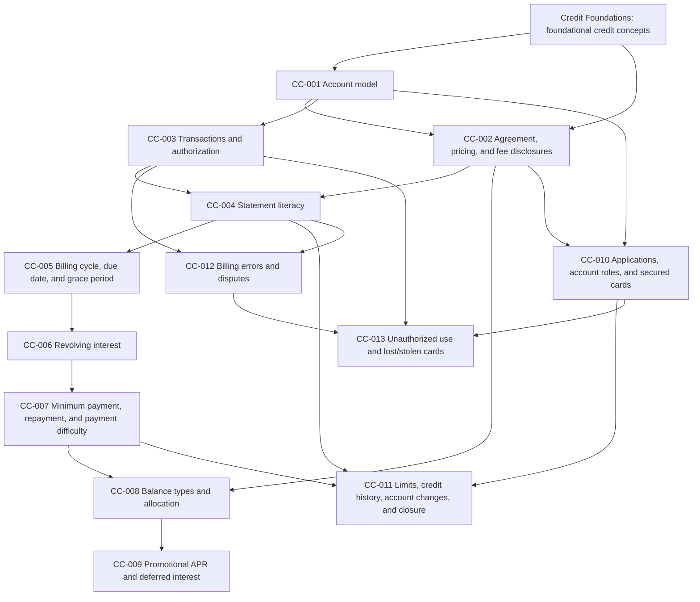

# Credit Cards World Blueprint — Formal Review

# 1. Review metadata

| Field | Value |
|---|---|
| Document reviewed | `research/credit-cards/CREDIT_CARDS_WORLD_BLUEPRINT.md` |
| Blueprint version | Unversioned research draft dated 2026-07-19 |
| Reviewed file SHA-256 | `e9a3b1c98961b9e4bdf87fc26dd765e70faa547ff0463c88cc2f86eccdd31216` |
| Review date | 2026-07-19 |
| Reviewer | Codex — curriculum architecture review |
| Review type | Formal World Blueprint review; no Educational Draft or compilation authorization |
| Review status | **APPROVED WITH MINOR REVISIONS** |
| Decision update | Jurisdiction and learner audience approved by user; accepted minor revisions incorporated into blueprint `1.0-rc1` |
| Implementation status | Revision complete; freeze pending Credit Foundations registry reconciliation and governance-owner clause-level verification |

### Meaning of the decision

The proposed Credit Cards world is educationally coherent, appropriately bounded, and suitable for approval after the required minor revisions in this review are applied and accepted. The decision does not freeze the blueprint, assign canonical workbook IDs, authorize workbook authoring, or resolve unavailable Credit Foundations registry mappings.

The review was completed against the entire 733-line blueprint, the project context supplied with the review request, the locally available FinLit Quest architecture and curriculum-pipeline documentation, and current federal primary sources. The named Platform Blueprint, Domain Blueprint, approved Credit Foundations World Blueprint, FQ-AUTH-001, and FQ-WRR-001 are not present in the local repository. Compliance with their detailed clauses therefore requires an authoritative governance-owner signoff before freeze.

### Post-review disposition

The user approved both recommended decisions:

- **Jurisdiction:** United States consumer credit cards; federal law and regulation as the instructional baseline; material state-law variation acknowledged where educationally appropriate; no state-by-state legal instruction; informational education rather than legal advice.
- **Audience:** Beginner consumers, inclusive of older teens and adults; plain-language instruction; no assumption of prior card ownership or use; under-21 rules only where relevant.

All accepted editorial, structural, and evidence revisions from this review have been incorporated into blueprint candidate `1.0-rc1`. The blueprint is not yet frozen because the authoritative Credit Foundations registry and the full governing specifications are unavailable locally.

---

# 2. Overall assessment

## Decision: APPROVED WITH MINOR REVISIONS

The blueprint succeeds as a research-backed curriculum architecture artifact. It establishes a clear purpose, uses Credit Foundations as a prerequisite, separates factual evidence from proposed structure, maintains a United States consumer-credit focus, and prevents advanced or adjacent subjects from expanding the core world.

The proposed 13-workbook shape is sound. No workbook must be added, removed, merged, or split. The instructional order should be preserved. Three scope reallocations are required:

1. Teach fees primarily through the agreement/pricing disclosure and periodic statement workbooks rather than as a separate combined theme in CC-009.
2. Treat rewards only as optional contextual literacy, not a core CC-009 outcome or world success criterion.
3. Narrow CC-013 to unauthorized use and lost/stolen-card response. Move anticipated payment difficulty and card-specific delinquency/default application into CC-007; move term changes, limit changes, and closure into CC-011.

These changes preserve all 13 planning positions while giving each workbook a clearer educational purpose.

The blueprint may be revised and returned for final approval without repeating its underlying research. Workbook authoring must not begin until the revised blueprint is formally approved and frozen under the existing governance process.

---

# 3. Governance compliance

## Compliance determination

**Complies with the governance constraints available for review, subject to formal-document verification before freeze.**

### Confirmed compliance

- The blueprint is research and curriculum planning only.
- It does not contain Educational Drafts, workbook prose, manifests, registry records, runtime assets, or compiler changes.
- It preserves the approved Research Scope → Educational Draft → Educational Review sequence.
- It does not redesign the frozen governance architecture or compiler.
- It recognizes Credit Foundations as the prerequisite world.
- It prohibits a CRF-016 and does not add Credit Foundations workbooks.
- It distinguishes FACT, HYPOTHESIS, and UNKNOWN rather than silently promoting assumptions.
- It uses authoritative sources before secondary sources.
- It remains neutral, product-independent, legally cautious, and beginner-oriented.
- It reserves stable IDs and canonical mappings for later approved stages.

### Governance verification limitation

The following named authorities were not locally available for clause-level comparison:

- Platform Blueprint
- Domain Blueprint
- Approved Credit Foundations World Blueprint
- FQ-AUTH-001 — Knowledge Authoring Specification
- FQ-WRR-001 — World Readiness Review Standard

No conflict is visible from the approved summaries provided in the review prompt. However, absence of the full documents means this review cannot certify exact terminology, required metadata fields, review signatures, source-age rules, or blueprint-freeze mechanics. That limitation is not a reason to redesign governance. It is a final-signoff condition.

### Frozen compiler compliance

The blueprint correctly ends before manifests or compilation. The approved workflow remains:

Research Scope → Educational Draft → Educational Review → Approved Educational Content → World Readiness Review → Generate Manifests → Manifest Review → Sequential Compilation → Registry Generation → Runtime Assets → Canonical Release → World Lock.

No compiler or runtime work is authorized by this review.

---

# 4. Strengths

1. **Strong prerequisite discipline.** The blueprint treats Credit Foundations as the source of general credit, borrowing, interest, repayment, delinquency, and default concepts.
2. **Clear operational purpose.** It teaches learners to understand and monitor an account rather than offering card-selection advice or optimization tactics.
3. **Evidence-backed sequence.** Account mechanics precede transactions; transactions precede statements; statements precede grace periods, interest, and minimum payments.
4. **Excellent statement emphasis.** The dedicated statement workbook reflects the central role of periodic statements under [Regulation Z §1026.7](https://www.consumerfinance.gov/rules-policy/regulations/1026/7/).
5. **Correct separation of payment concepts.** Statement balance, current balance, minimum payment, and due date are not treated as synonyms.
6. **Correct separation of problem types.** Merchant resolution, billing error, chargeback terminology, and unauthorized use are distinguished rather than collapsed.
7. **Legally cautious consumer-protection framing.** Federal baseline rights and action windows are presented without individualized legal advice.
8. **Strong boundary management.** Bankruptcy, litigation, business cards, identity-theft recovery, issuer recommendations, and rewards optimization are deferred.
9. **Product neutrality.** No issuer, card, rewards program, or marketing claim is recommended.
10. **Good uncertainty handling.** Missing registry mappings, learner audience, jurisdiction approval, and quantitative depth are exposed instead of invented.
11. **Durable treatment of volatile values.** The blueprint favors locating current disclosures over memorizing fee caps.
12. **Appropriate quantitative restraint.** It proposes conceptual interest understanding and statement interpretation rather than unnecessary manual reconstruction of average daily balances.

---

# 5. Required revisions

Only the revisions below are required for approval.

## Editorial revisions

1. Add a formal **World Success Criteria** section using the recommended text in Section 10 of this review.
2. Add a blueprint version and approval-status field so the approved revision can be identified independently of its file date.
3. Use **billing cycle** as the learner-facing preferred term and note **billing period** as the regulatory/contract synonym. Avoid alternating without explanation.
4. Clarify that a credit card account is open-end credit and should not be described as identical to a closed-end loan. Reuse the approved Loan concept only for comparison.
5. Replace any unqualified “residual/trailing interest” objective with cautious, agreement-dependent wording or remove it until direct authoritative support is added.
6. Expand the provisional reuse list to include the review prompt’s likely Credit Foundations concepts: Debt, Principal, Interest rate, Credit agreement, Revolving credit, and Creditworthiness.

## Structural revisions

1. Narrow CC-009 from **Fees, Promotions, Deferred Interest, and Rewards** to **Promotional APRs and Deferred Interest**.
   - Teach fee categories and triggers in CC-002.
   - Reinforce actual charged fees in CC-004.
   - Keep rewards as optional context only.
2. Narrow CC-013 from **Unauthorized Use, Account Changes, and Early Response** to **Unauthorized Use and Lost or Stolen Cards**.
   - Move anticipated payment difficulty plus card-specific Delinquency and Default application to CC-007.
   - Move term changes, limit changes, and account closure to CC-011.
3. Rename CC-008 to foreground its instructional purpose: **Balance Types and Payment Allocation**.
4. Update the dependency graph to reflect the scope reallocation without changing the 13-workbook order.

## Governance-related revisions

1. Record explicit approval or rejection of the recommended United States jurisdiction.
2. Record explicit approval or rejection of the recommended beginner consumer audience.
3. Reconcile concept names and IDs against the authoritative Credit Foundations registry before blueprint freeze. If the registry is not yet generated, retain a clearly marked provisional crosswalk and prohibit canonical identifiers until reconciliation.
4. Obtain governance-owner confirmation that the revised artifact satisfies the full Platform Blueprint, Domain Blueprint, approved Credit Foundations World Blueprint, FQ-AUTH-001, and FQ-WRR-001.

## Evidence-related revisions

1. Add [Regulation Z §1026.6](https://www.consumerfinance.gov/rules-policy/regulations/1026/6/) or [§1026.60](https://www.consumerfinance.gov/rules-policy/regulations/1026/60/) as direct support for account-opening/application pricing disclosures.
2. Add [Regulation Z §1026.13](https://www.consumerfinance.gov/rules-policy/regulations/1026/13/) as direct primary support for billing-error resolution.
3. Add [Regulation Z §1026.12](https://www.consumerfinance.gov/rules-policy/regulations/1026/12/) as direct primary support for special card provisions and unauthorized-use liability.
4. Either add direct authoritative evidence for residual/trailing interest or omit it from the core concept inventory.

No other revision is required for approval.

---

# 6. Workbook sequence review

The sequence remains at 13 workbooks. Planning IDs remain noncanonical.

| Planning ID | Proposed title | Decision | Recommended title | Recommended position | Merge or split | Rationale |
|---|---|---|---|---:|---|---|
| CC-001 | How a Credit Card Account Works | Retain | How a Credit Card Account Works | 1 | None | Establishes the account, parties, revolving capacity, limit, available credit, and balance required by every later workbook. |
| CC-002 | Reading Card Terms Before Use | Retain with title refinement | Reading a Credit Card Agreement and Pricing Disclosure | 2 | None | One clear purpose: locate material account costs and conditions. Absorb core fee categories here. |
| CC-003 | Transactions, Authorization, and Available Credit | Retain | Transactions, Authorization, and Available Credit | 3 | None | Correctly follows the account model and precedes statement reconciliation. |
| CC-004 | Billing Cycles and Statement Literacy | Retain with title refinement | Reading a Credit Card Statement | 4 | None | The title should emphasize measurable statement-reading competency; billing-cycle mechanics remain part of the workbook. Reinforce charged fees here. |
| CC-005 | Statement Balance, Due Date, and Grace Period | Retain with title refinement | Billing Cycles, Due Dates, and Grace Periods | 5 | None | Connects the cycle close and due date to grace-period eligibility before interest calculation. |
| CC-006 | Revolving Balances and Interest Charges | Retain | Revolving Balances and Interest Charges | 6 | None | Correctly extends existing Interest and APR concepts into card-specific mechanics. |
| CC-007 | Minimum Payments and the Repayment Path | Retain with scope clarification | Minimum Payments and the Repayment Path | 7 | None | Add card-specific delinquency/default consequences and early contact when payment trouble is expected; these are part of the repayment path. |
| CC-008 | Purchases, Cash Advances, and Balance Transfers | Retain with title refinement | Balance Types and Payment Allocation | 8 | None | The revised title captures the transferable concept: different balance categories can have different rates, fees, grace treatment, and allocation. |
| CC-009 | Fees, Promotions, Deferred Interest, and Rewards | Revise scope | Promotional APRs and Deferred Interest | 9 | Do not split; remove/reallocate topics | Four themes are too broad. Fees belong in terms/statements; rewards are optional context. Promotions and deferred interest form one coherent purpose. |
| CC-010 | Applying, Account Roles, and Secured Cards | Retain with title refinement | Opening and Sharing a Credit Card Account | 10 | None | Ability to pay, account responsibility, authorized users, joint liability, and secured cards all concern access to and responsibility for an account. |
| CC-011 | Credit Limits, Utilization, and Credit History | Retain with expanded lifecycle scope | Credit Limits, Credit History, and Account Changes | 11 | None | Keep utilization and reporting; absorb limit changes, material account changes, and closure effects from CC-013. |
| CC-012 | Billing Errors, Merchant Problems, and Disputes | Retain | Billing Errors, Merchant Problems, and Disputes | 12 | None | One classification-and-response purpose; remains separate from unauthorized use. |
| CC-013 | Unauthorized Use, Account Changes, and Early Response | Revise scope | Unauthorized Use and Lost or Stolen Cards | 13 | Do not split; reallocate account changes and payment difficulty | A focused final protection workbook prevents confusion between permission, billing errors, and unauthorized use. |

## Recommended final workbook sequence

1. How a Credit Card Account Works
2. Reading a Credit Card Agreement and Pricing Disclosure
3. Transactions, Authorization, and Available Credit
4. Reading a Credit Card Statement
5. Billing Cycles, Due Dates, and Grace Periods
6. Revolving Balances and Interest Charges
7. Minimum Payments and the Repayment Path
8. Balance Types and Payment Allocation
9. Promotional APRs and Deferred Interest
10. Opening and Sharing a Credit Card Account
11. Credit Limits, Credit History, and Account Changes
12. Billing Errors, Merchant Problems, and Disputes
13. Unauthorized Use and Lost or Stolen Cards

---

# 7. Concept reuse review

## Existing Credit Foundations concepts to reuse

### Confirmed by supplied project context

These concepts must be referenced using their approved Credit Foundations meanings, not redefined:

- Credit
- Borrower
- Creditor
- Loan
- Interest
- APR
- Repayment
- Delinquency
- Default

### Additional reuse candidates identified by the review prompt

Exact registry mappings remain provisional:

- Debt
- Principal
- Interest rate
- Credit agreement
- Revolving credit
- Creditworthiness

### Other likely Credit Foundations reuse candidates

These require registry confirmation:

- Credit limit
- Due date
- Fee
- Credit report
- Credit score
- Payment history
- Amounts owed / utilization
- Secured credit
- Cosigner / guarantor
- Fraud
- Dispute

## New Credit Cards concepts or card-specific extensions

The following are appropriate for this world if the registry does not already contain them:

- Credit card account
- Card issuer
- Cardholder
- Available credit
- Pricing disclosure
- Authorization
- Pending and posted transaction
- Billing cycle as applied to a card
- Cycle closing date
- Periodic statement
- Statement balance
- Current balance
- Minimum payment and minimum-payment warning
- Purchase grace period
- Daily periodic rate
- Average daily balance
- Purchase, cash-advance, balance-transfer, penalty, and promotional APR categories
- Payment allocation
- Cash advance
- Balance transfer
- Deferred interest
- Authorized user
- Joint accountholder
- Secured credit card and security deposit
- Billing-error notice
- Disputed and undisputed amounts
- Unauthorized use
- Lost or stolen card
- Merchant dispute
- Credit-limit reduction
- Account closure as a card-account event

## Possible naming collisions

| Proposed term | Potential existing term | Review direction |
|---|---|---|
| Card issuer | Creditor | Treat issuer as a card-specific role of creditor; do not duplicate the general creditor definition. |
| Cardholder | Borrower | Explain that cardholder and borrower overlap but are not always identical because authorized users may be cardholders without debt liability. |
| Revolving balance | Revolving credit | Reuse Revolving credit if canonical; define revolving balance as an account state only if needed. |
| Credit line | Credit limit | Select the registry’s preferred canonical term and treat the other as an alias or contextual phrase. |
| Account agreement | Credit agreement | Reuse Credit agreement; teach card agreement as the product-specific form. |
| Purchase APR / other APR categories | APR / Interest rate | Extend the approved APR concept with balance-type relationships; do not create independent general APR definitions. |
| Billing period | Billing cycle | Choose one learner-facing canonical label and map the other as a synonym. |
| Minimum payment | Repayment | Keep Minimum payment as a card-specific required amount; reuse Repayment for the broader process. |
| Secured credit card | Secured credit | Treat the card as a product-specific instance of secured credit, subject to registry meaning. |
| Payment credit | Credit | Avoid using “credit” without context; use account credit or payment posted to the account. |
| Fraud | Unauthorized use | Do not use as synonyms. Fraud is broader; unauthorized use has a card-specific legal meaning. |
| Dispute / chargeback / billing error | Dispute | Preserve distinct terms and relationships; do not imply every dispute receives the statutory billing-error process. |
| Statement balance / current balance | Balance | Reuse general Balance if canonical while creating clear card-specific subtypes. |

## Provisional mappings awaiting registry availability

All mappings in this section are provisional and must not become canonical IDs:

```text
Credit card account       -> Credit + Revolving credit + product-specific account
Card issuer               -> Creditor + issuer role
Cardholder with liability -> Borrower + cardholder role
Authorized user           -> cardholder/access role without assumed borrower liability
Card agreement            -> Credit agreement + card-specific disclosures
Purchase APR              -> APR + purchase-balance relationship
Minimum payment           -> Repayment + card-specific cycle obligation
Delinquent card account   -> Delinquency + credit-card account
Defaulted card account    -> Default + credit-card account
Secured credit card       -> Secured credit + credit-card product
Revolving utilization     -> utilization/amounts owed + revolving account relationship
```

Registry reconciliation may collapse, alias, or relate these records. It must not change approved Credit Foundations wording during import or compilation.

---

# 8. Dependency review

## Decision

**Approved with the minor scope corrections shown below.**

The original dependency logic is coherent. The corrected graph preserves the sequence while moving account changes to CC-011 and payment difficulty to CC-007.



## Sequence findings

1. The learner first understands what the account is and who the principal parties are.
2. The agreement and pricing disclosure establish the applicable terms before transactions and costs are analyzed.
3. Authorization and posting precede statement reconciliation.
4. Statement literacy precedes grace-period, interest, minimum-payment, and dispute instruction.
5. Grace-period eligibility precedes interest calculation.
6. Interest precedes minimum-payment consequences.
7. Multiple balance types precede promotions because promotional balances depend on category, rate, duration, and payment allocation.
8. Application, role, and secured-card instruction follows core account literacy; this is pedagogically acceptable even though application occurs earlier in a real account lifecycle.
9. Credit-history and account-change instruction follows repayment and responsibility concepts.
10. Billing errors precede unauthorized use so learners can classify unwanted charges correctly.

No material reorder is required.

---

# 9. World boundaries

## Included topics

- United States consumer credit card account structure.
- Issuer, liable cardholder, joint accountholder, authorized-user, and secured-card roles.
- Account and pricing disclosures.
- Credit limits, available credit, authorization, posting, and balances.
- Billing cycles and standard statement reading.
- Due dates, statement balances, minimum payments, and grace periods.
- Card-specific APR categories and conceptual interest application.
- Purchases, cash advances, balance transfers, and payment allocation.
- Common fee categories and where triggers/amounts are disclosed.
- Promotional APRs and deferred interest.
- Card-specific credit-history and utilization effects.
- Billing errors, merchant problems, dispute procedures, unauthorized use, and lost/stolen-card response.
- Card-specific delinquency/default application, account changes, credit-limit changes, and closure.
- Responsible account management as comprehension and monitoring, not personalized advice.

## Context-only topics

- Debit cards, prepaid cards, charge cards, and BNPL for category comparison only.
- Rewards as a conditional account benefit, not an optimization target.
- Under-21 application rules when age-relevant.
- Secured-card availability and purpose without product comparisons.
- Identity theft as an escalation possibility after unauthorized activity.
- Budget/affordability concepts by reference to approved foundational content.
- State-law variation as a caution that federal rules are the baseline, not the entire legal landscape.

## Deferred topics

- Rewards optimization and points valuation.
- Travel hacking and card churning.
- Balance-transfer strategy or debt-arbitrage tactics.
- Business and corporate cards.
- Secured-card product comparisons or issuer “graduation” recommendations.
- Charge-card and BNPL full curricula.
- Comprehensive identity-theft recovery.
- Advanced credit-scoring strategy.
- Debt collection, debt settlement, and hardship-program comparison.
- Bankruptcy and litigation.
- Merchant acquiring, interchange, network settlement, and payment-system engineering.

## Explicit exclusions

- Issuer-specific recommendations or rankings.
- Personalized financial, investment, tax, or legal advice.
- Mortgage, auto, student, and small-business underwriting.
- Using credit to invest.
- State-by-state legal instruction.
- Memorization of volatile fee caps as durable knowledge.
- Manual reconstruction of complex average-daily-balance calculations as a core competency.

---

# 10. World Success Criteria

The following is the recommended final section for insertion into the blueprint.

## World Success Criteria

After completing the Credit Cards world, a learner can:

1. Explain that a credit card provides access to an open-end credit account and distinguish it from debit, prepaid value, and a closed-end loan in a simple comparison.
2. Identify the creditor/issuer, borrower or liable accountholder, authorized user, account, card, credit limit, available credit, and outstanding balance in a scenario.
3. Locate and interpret the major pricing and payment terms in a neutralized credit card agreement or account-opening disclosure, including applicable APR categories, grace-period conditions, and fee triggers.
4. Trace a purchase through authorization, pending activity, posting, billing-cycle close, statement appearance, payment, and restoration of available credit.
5. Read a standard credit card statement and identify the statement balance, current-balance distinction, minimum payment, due date, transactions, credits, fees, interest charges, and minimum-payment warning.
6. Explain the relationship among a billing cycle, cycle closing date, statement date, due date, and payment receipt.
7. Determine in a straightforward scenario whether a purchase grace period may apply and explain why paying on time is not always the same as paying the statement balance in full.
8. Explain conceptually how APR, a daily periodic rate, account balances, and time can produce an interest charge, without claiming that every issuer uses one identical method.
9. Explain why making only minimum payments generally increases repayment time and total interest and identify the minimum-payment warning on a statement.
10. Compare a purchase, cash advance, and balance transfer by applicable APR, fee, limit, grace-period treatment, and payment-allocation implications using disclosed terms.
11. Distinguish a promotional APR from deferred interest and identify the duration, expiration condition, payment requirement, and principal risk in a simple offer.
12. Identify common fee categories and determine from the agreement or statement what event triggered a fee, without relying on memorized fee amounts.
13. Explain at a high level how on-time payment history and reported balances relative to credit limits can affect credit history, without promising a particular score change.
14. Distinguish an individual or joint liable accountholder from an authorized user and explain why a secured-card deposit does not replace the monthly repayment obligation.
15. Classify a transaction problem as merchant resolution, billing error, or possible unauthorized use and identify the appropriate first channel and applicable federal-baseline timing where provided.
16. Identify basic federal consumer protections for billing errors and unauthorized use while recognizing that state law, account agreements, and individual facts can affect a specific case.
17. Explain how late payment, delinquency, default, credit-limit changes, and account closure may affect a credit card account and recognize that closing an account does not erase an unpaid balance.
18. Demonstrate responsible account monitoring by reviewing statements, recognizing changes or unfamiliar activity, and locating authoritative contact and dispute information without receiving personalized financial advice.

Success must be demonstrated through later approved educational assessments. Completion of a word puzzle alone is not evidence of these competencies.

---

# 11. Resolution of open questions

| # | Question | Current classification | Recommended resolution | Evidence or rationale | User decision required | Blocking status |
|---:|---|---|---|---|---|---|
| 1 | What are the exact stable IDs and approved definitions in the Credit Foundations registry? | UNKNOWN | **BLOCKING UNKNOWN** — reconcile after the Credit Foundations registry is locally available; do not invent IDs. | The prompt permits provisional reuse, but canonical mappings cannot be frozen without the authoritative registry. | No new content decision; governance/registry access required. | Blocks blueprint freeze and canonical IDs; does not invalidate the educational structure. |
| 2 | Which CRF workbooks own credit report, score, limit, utilization, fee, minimum payment, and secured-credit concepts? | UNKNOWN | **BLOCKING UNKNOWN** — produce a source-workbook/concept crosswalk from approved CRF records. | Ownership determines whether Credit Cards references, extends, or introduces each concept. | No new content decision; authoritative records required. | Blocks concept-inventory freeze; does not block sequence review. |
| 3 | Is the intended jurisdiction explicitly United States federal consumer law? | UNKNOWN | **RESOLVED AND APPROVED** — United States consumer credit cards, federal law as baseline, material state variation acknowledged, no state-by-state curriculum, informational rather than legal advice. | User approved the recommendation; all principal evidence is CFPB, Regulation Z, FDIC, and FTC material. | No further decision. | Not blocking. |
| 4 | What learner age and reading level should drive the world? | UNKNOWN | **RESOLVED AND APPROVED** — beginner consumers, inclusive of older teens and adults, using plain language; no prior-use assumption; under-21 rules remain age-relevant context. | User approved the recommendation; this aligns with FinLit Quest’s beginner, application-oriented architecture. | No further decision. | Not blocking. |
| 5 | Are retail/private-label cards included as ordinary examples or deferred? | UNKNOWN | **RESOLVED** — permit neutral examples when they illustrate ordinary card mechanics or deferred interest; no separate workbook or issuer/product comparison. | Private-label cards can illustrate the same account mechanics without expanding the world. | No. | Not blocking. |
| 6 | Are charge cards and BNPL comparison-only, and where are they taught fully? | UNKNOWN | **RESOLVED** — comparison-only here; full treatment deferred to future approved payments/borrowing worlds. Do not name an unapproved destination world as canonical. | Their rules and protections differ and are unnecessary for core card competency. | No. | Not blocking. |
| 7 | Is rewards literacy required or optional? | UNKNOWN | **RESOLVED** — optional context only; not a workbook purpose or world success criterion. | Rewards can change and may distract from durable cost and repayment literacy. | No. | Not blocking. |
| 8 | Are under-21 rules core or a youth branch? | UNKNOWN | **RESOLVED** — age-relevant context within CC-010, not a standalone or universal core competency. | [Regulation Z §1026.51](https://www.consumerfinance.gov/rules-policy/regulations/1026/51/) contains special rules for applicants under 21; relevance depends on learner age. | No, unless the user wants a youth-specific edition. | Not blocking. |
| 9 | What numerical reasoning is expected? | UNKNOWN | **RESOLVED** — statement interpretation, qualitative cost comparison, and simple arithmetic; explain daily-rate/average-balance mechanics conceptually; no full manual average-daily-balance reconstruction as a core requirement. | The blueprint targets beginners and durable operational literacy. | No. | Not blocking. |
| 10 | Which source-review interval applies to legally changeable content? | UNKNOWN | **DEFERRED** — use the interval and controlled-values process already required by FQ-AUTH-001/FQ-WRR-001; verify the authoritative rule before Educational Review and canonical release rather than creating a new governance rule here. | The governing documents are not locally available, and this review may not invent a new standard. | No curriculum decision; governance-owner confirmation required. | Does not block blueprint structure; blocks canonical release if source freshness is unverified. |

## Approved jurisdiction and audience decisions

### Jurisdiction — approved

- United States consumer credit-card education.
- Federal law and regulation as the primary baseline.
- Material state-law variation acknowledged where relevant.
- No attempt to teach every state-specific rule in the core world.

### Learner audience — approved

- Beginner consumer learners, inclusive of older teens and adults.
- Plain-language, product-neutral instruction with readable definitions and applied scenarios.
- No assumption that the learner already owns a credit card.
- Under-21 application rules used as age-relevant context, not a universal core outcome.
- Conceptual and statement-based quantitative work rather than advanced finance calculations.

---

# 12. Final approval conditions

The Credit Cards World Blueprint may be frozen only after every condition is complete:

| Condition | Status |
|---|---|
| Apply accepted editorial and structural revisions | **COMPLETE** in blueprint `1.0-rc1` |
| Insert the approved 18-point World Success Criteria | **COMPLETE** |
| Update the workbook list and dependency graph while preserving 13 workbooks | **COMPLETE** |
| Approve United States jurisdiction | **COMPLETE** — user approved |
| Approve beginner consumer audience | **COMPLETE** — user approved |
| Add direct Regulation Z support and qualify unsupported residual-interest wording | **COMPLETE** |
| Reconcile concepts against the authoritative Credit Foundations registry and approved CRF workbook ownership records | **BLOCKED — records unavailable locally** |
| Confirm detailed compliance against the Platform Blueprint, Domain Blueprint, approved Credit Foundations World Blueprint, FQ-AUTH-001, and FQ-WRR-001 | **BLOCKED — full governing documents unavailable locally** |
| Assign frozen version 1.0 and authorize planning-ID transition if governance permits | **PENDING** the two blocked checks |
| Confirm no workbook authoring, manifests, compilation, runtime work, or application changes began before freeze | **COMPLETE TO DATE** |

After these conditions are satisfied, the next authorized stage is the existing **Research Scope** workflow for the first approved Credit Cards workbook. This review does not authorize an Educational Draft.

---

# Review conclusion

The Credit Cards World Blueprint is ready for a controlled minor revision cycle. Its educational structure does not require new research, a different workbook count, or a redesigned sequence. The required work is limited to scope tightening, success-criteria insertion, primary-source reinforcement, explicit jurisdiction/audience approval, and authoritative concept/governance reconciliation.

**Final review decision: APPROVED WITH MINOR REVISIONS.**
